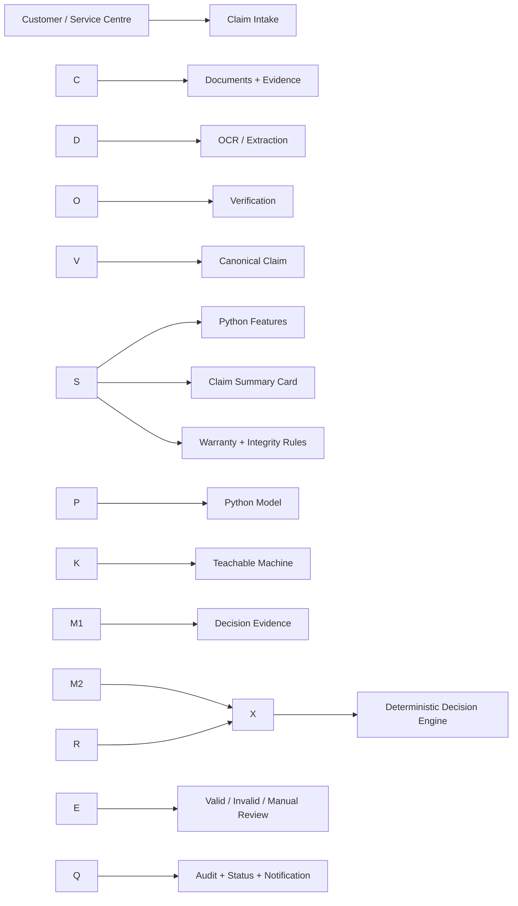
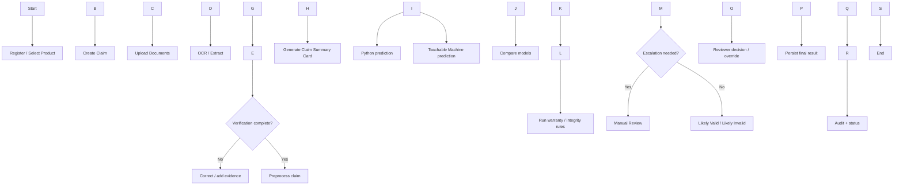
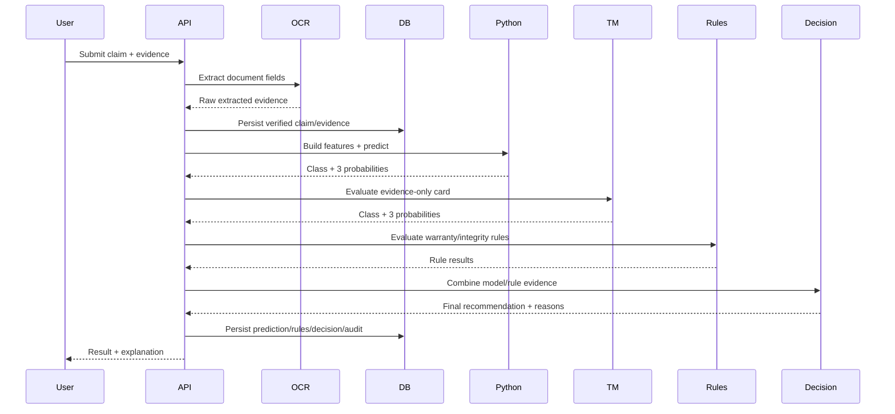

# AssureX Claim Engine — Technical Project Report

**Submission artifact:** AssureX Claim Engine — NextWave AI and ML

**Report status:** Evidence complete engineering resubmission with one documented SRS metric gap.

The major evidence gaps identified during hardening have been addressed. The corrected dataset, Claim Summary Cards, train/validation/test split, card fidelity, model artifacts, Teachable Machine evaluation, 30 case model comparison, standalone warranty policies, and automated validation are now retained as evidence.

Some broader user facing SRS capabilities remain **Partial** or **Pending** where the implementation or demonstration is not complete. These statuses are retained rather than presented as fully implemented.

The final Teachable Machine measurement is also reported exactly: **84.8889% (191/225) on the independent unseen test set**, against the SRS target of **≥85%**. The gap is **0.1111 percentage points** and is not presented as a pass.

## 1\. Executive Summary

AssureX is an AI-assisted warranty claim decision support application designed
around evidence rather than a single model prediction. A claim is represented as
structured data, supporting documents, repair information, warranty conditions,
and integrity signals. The system uses a Python classification model as one
source of predictive evidence, an evidence only Claim Summary Card as the input
to a separate Google Teachable Machine image model, a configurable warranty
rule engine, consistency checks, duplicate detection, and a deterministic final
decision engine.

The key decision-design principle is:

> \\\\\*\\\\\*A model prediction is evidence, not the entire business decision.\\\\\*\\\\\*

The current Python baseline uses 1,500 synthetic claim records divided into
1,050 training, 225 validation, and 225 held out test claims, balanced across
Valid Claim, Invalid Claim, and Manual Review. The saved Random Forest model has
92.8889% held-out test accuracy. Five-fold stratified cross-validation on the
training split has mean accuracy 90.7619% with standard deviation 1.7196%.
Class-wise precision, recall, F1-score, and the test confusion matrix are stored
in the model evidence files.

The Claim Summary Card generation pipeline was hardened for resubmission. The
same CSV record is now reconstructed into a canonical claim before its card is
rendered, including the document-availability and repair-history evidence that
was previously lost during conversion. A deterministic audit across all 1,500
claims reports **zero card-data field mismatches**.

The repository also contains separate train/validation/test CSV artifacts, a
claim to image mapping, dataset statistics, data dictionary, three explicit
warranty-policy files, a browser batch evaluator for the real Teachable Machine
model, and a report-generation utility for the required 30+ unseen-claim model
comparison.

The retained Teachable Machine Model A was retrained on the corrected 2,100-card

training set and evaluated against the independent 225-card unseen test set.

The production artifact is retained under `static/teachable_machine/` and was

byte compared against the retained exported Model A artifact used for evaluation.


The final Teachable Machine result is 191 correct predictions out of 225,

or 84.8889% accuracy. The SRS target is at least 85%, so the measured result

is 0.1111 percentage points below the stated target. This gap is reported

explicitly rather than rounded upward.


The repository also retains the 30-case Python/Teachable Machine comparison

report as separate integration evidence.

\---

## 2\. Problem Definition

Warranty-claim assessment combines several kinds of evidence at once:

* purchase and warranty dates;
* product identity and serial numbers;
* receipts, warranty cards and supporting evidence;
* fault and damage information;
* previous repair or replacement history;
* document completeness;
* possible duplicate submissions; and
* model-based classification.

A useful claim system must therefore distinguish between **prediction** and
**adjudication**. A classifier can estimate a class from historical patterns,
but it does not by itself establish that a warranty is active, that a serial
number is consistent, that required evidence exists, or that the claim should
be escalated to a reviewer.

AssureX addresses the broader problem by combining predictive evidence with
explicit business rules and an auditable decision process.

\---

## 3\. Background and Business Necessity

The SRS frames the application as a claim-processing workflow rather than a
standalone machine-learning exercise. In that workflow a customer or service
centre creates a claim, supplies evidence, the application extracts and checks
information, the models independently assess the claim, warranty policies are
evaluated, inconsistencies are identified, and a final recommendation is
produced.

The architecture therefore prioritizes:

1. **Traceability** — a reviewer can inspect what evidence led to a decision.
2. **Consistency** — model disagreement and rule violations do not silently
disappear.
3. **Configurability** — warranty conditions live in policy files rather than
being duplicated across request handlers.
4. **Human review** — uncertain or conflicting cases can be routed instead of
being forced into a binary decision.
5. **Reproducibility** — dataset generation, training and evidence generation
are scripted.

\---

## 4\. Proposed Solution

### 4.1 Decision pipeline

```text
Claim + Supporting Evidence
            |
            +------------------------------+
            |                              |
            v                              v
  Structured/tabular data        Evidence-only Claim Summary Card
            |                              |
            v                              v
      Python classifier          Google Teachable Machine
            |                              |
            +---------------+--------------+
                            |
                            v
               Model comparison / confidence
                            |
                            +-------------------+
                            |                   |
                            v                   v
                  Warranty / integrity   Duplicate / evidence
                       rule engine       completeness / consistency
                            |                   |
                            +---------+---------+
                                      |
                                      v
                             Deterministic Decision
                                      |
                   +------------------+------------------+
                   |                  |                  |
                   v                  v                  v
              Likely Valid      Likely Invalid    Manual Review
```

### 4.2 Architectural boundary

The Python and Teachable Machine models remain independent. Neither model is
allowed to embed business-rule decisions. The rule engine evaluates warranty and
integrity facts. The final decision engine combines the resulting evidence into
one of:

* `Likely Valid`
* `Likely Invalid`
* `Manual Review Required`

The decision engine records reasons, supporting factors, opposing factors,
model comparison evidence, rule results, and review information.

\---

## 5\. Purpose of the Document

This report documents the AssureX solution against the SRS. It is intended to
let a reviewer understand the system, reproduce the data/model artifacts,
inspect the decision flow, and distinguish verified functionality from remaining
competition evidence.

\---

## 6\. Scope

### In scope

* claim domain models and validation;
* user registration/login and session handling;
* claim and product persistence;
* document upload, hashing and OCR integration;
* Python ML inference using the saved Random Forest artifact;
* evidence-only Claim Summary Card generation;
* Teachable Machine browser integration;
* configurable warranty rules;
* contradiction, missing-document and duplicate checks;
* deterministic model/rule adjudication;
* audit and reviewer-override foundations;
* reproducible dataset/card/evidence generation;
* automated tests.

### Deliberately not over-engineered

The solution does not introduce distributed services, message queues, cloud
microservices, or a separate analytics platform. The SRS permits SQLite,
FastAPI, JavaScript/HTML and local data assets, so the design keeps the core
workflow inspectable and explainable.

\---

## 7\. Assumptions

* The competition dataset is synthetic and is described as such.
* The saved Python model is treated as immutable during inference.
* Teachable Machine is trained independently on Claim Summary Cards generated
from the same underlying claim records.
* Warranty rules are configurable policy evidence, not model predictions.
* Human review is necessary for uncertain, conflicting or incomplete evidence.

\---

## 8\. Constraints

* The SRS requires one common dataset represented both as structured claim
records and as Claim Summary Card images.
* Training, validation and test claims must remain separated.
* The Claim Summary Card must not contain a Python prediction, confidence score,
or final decision.
* The final claim decision must be produced using the team's application logic,
Python model, Teachable Machine model and warranty-rule engine rather than an
external generative-AI decision API.
* AI-assisted development must be declared and independently reviewed/tested.

\---

## 9\. Requirements Traceability

The SRS requires the team to implement the functional and non-functional
requirements, document them, and submit supporting source/data/model evidence.
The matrix below is intentionally conservative.

**Status meanings**

* **Implemented** — code exists and is covered by automated tests or direct
artifact inspection.
* **Partial** — the main technical foundation exists but the full SRS workflow
or demonstration evidence is incomplete.
* **Pending** — not yet implemented or not yet evidenced.

|SRS capability|Status|Evidence / remaining gap|
|-|-|-|
|User registration/login|Implemented|FastAPI auth endpoints + tests|
|Product registration|Partial|Product persistence exists; full user-facing workflow needs final demo|
|Warranty registration/tracking|Partial|Warranty model/rules exist; full tracking UI remains incomplete|
|Receipt/invoice upload|Partial|Secure upload path exists; final document workflow is incomplete|
|OCR extraction|Partial|Tesseract/PDF integration exists; representative extraction evidence needed|
|Extracted-data verification|Pending|Correction UI not fully demonstrated|
|Warranty expiry alerts|Pending|Notification model exists; complete trigger workflow not evidenced|
|Claim registration|Implemented|Authenticated registration + persistence + uniqueness check|
|Claim information collection|Partial|Domain schema and persistence cover core fields; full UI collection incomplete|
|Fault/damage evidence upload|Partial|Generic secure document ingestion exists; full media workflow incomplete|
|Repair history management|Partial|Domain/persistence/rule support exists; complete management UI incomplete|
|Document organization|Partial|Documents are stored under claim records; full replace/remove/download UX incomplete|
|Data validation|Implemented/Partial|Pydantic + file checks + duplicate IDs; full UX validation matrix incomplete|
|Python preprocessing|Partial|Feature engineering and pipeline exist; detailed preprocessing report included|
|Common dataset|Implemented|1,500 records with exact 70/15/15 split|
|Python classification model|Implemented|Candidate comparison + Random Forest artifact|
|Python confidence scores|Implemented|All three class probabilities returned|
|Claim Summary Card|Implemented|Evidence-only renderer; fidelity audit = 0 mismatches|
|Teachable Machine classification|Implemented|Corrected 2,100-card training set; retained production artifact; independent 225-card test evaluation = 84.8889%|
|Model prediction comparison|Implemented|Decision engine computes agreement|
|Confidence difference|Implemented|Absolute top-confidence difference|
|Consistency status|Implemented|Strong / Acceptable / Weak / Disagreement / Uncertain|
|Warranty-rule validation|Implemented|Configurable policy-driven rule engine|
|Configurable policy files|Implemented|Active combined policy + three standalone policy artifacts|
|Serial verification|Implemented/Partial|Canonical/rule support; full multi-document extraction demo incomplete|
|Contradiction detection|Implemented|Date and extracted-identifier consistency rules|
|Missing-document detection|Implemented|Required/conditional document groups|
|Duplicate claim detection|Implemented|Claim-level duplicate logic and document hash detection|
|Document duplicate detection|Implemented|SHA-256 evidence stored and compared|
|Claim summary/explanation|Partial|Decision explanation and evidence structure exist; richer summary UX incomplete|
|Claim preparation assistance|Partial|Missing evidence can be represented; complete guidance UI incomplete|
|Final claim decision|Implemented|Deterministic decision engine|
|Decision explanation|Implemented|Supporting/opposing factors + reasons + rule results|
|Manual review queue foundation|Implemented|Escalation + reviewer override persistence|
|Reviewer comments/override|Implemented|Protected override path + audit history|
|Claim status tracking|Implemented/Partial|Status enum/persistence exists; complete visual tracking incomplete|
|Notifications|Partial|Persistence exists; complete notification catalogue/triggers incomplete|
|User dashboard|Pending|Not fully implemented|
|Administrator dashboard|Pending|Not fully implemented|
|Search/filtering|Pending|Not fully implemented|
|Analytics/reporting|Partial|Evidence reports exist; full application analytics dashboard incomplete|
|Downloadable claim report|Partial|Evidence generation exists; full user-facing download UX incomplete|
|Data export|Pending|Not fully implemented|
|Relational data storage|Implemented|SQLite + SQLAlchemy models|
|Audit trail|Implemented|Claim/document/model/rule/review audit records|
|Model version tracking|Implemented|Model metadata linked to artifact|
|Error handling|Partial|API errors are controlled; full UX coverage incomplete|
|Monitoring/anomaly alerts|Pending|Not fully implemented|

\---

## 10\. Database Design

The application uses SQLite through SQLAlchemy. Core records are separated so
that the decision evidence is not stored as one opaque JSON blob.

```text
users
  |
  +---- products ---- warranties
  |          |
  |          +---- repairs
  |
  +---- claims
            |
            +---- documents
            +---- predictions
            +---- rule\\\\\\\_results
            +---- decisions
            +---- audit\\\\\\\_logs
            +---- notifications
```

### Core entities

|Entity|Purpose|
|-|-|
|Users|Authentication, role and ownership|
|Products|Product identity/purchase information|
|Warranties|Warranty dates and policy-related facts|
|Claims|Claim facts, state and evidence flags|
|Documents|Uploaded evidence, hashes, OCR output and verification status|
|Repairs|Previous repair history and authorization|
|Predictions|Python/TM predictions, probabilities and model version|
|Rule Results|Individual warranty/integrity rule outcomes|
|Decisions|Final recommendation and complete decision evidence|
|Audit Logs|Important lifecycle actions|
|Notifications|Status/evidence alerts|

\---

## 11\. Data Dictionary

The machine-readable data dictionary is at `reports/data\\\\\\\_dictionary.csv`.
The primary dataset fields include:

* `claim\\\\\\\_id`
* `product\\\\\\\_name`
* `category`
* `brand`
* `model\\\\\\\_number`
* `serial\\\\\\\_number`
* `retailer`
* `purchase\\\\\\\_date`
* `purchase\\\\\\\_price`
* `warranty\\\\\\\_duration\\\\\\\_months`
* `warranty\\\\\\\_end\\\\\\\_date`
* `claim\\\\\\\_date`
* `product\\\\\\\_age\\\\\\\_days`
* `remaining\\\\\\\_warranty\\\\\\\_days`
* `fault\\\\\\\_type`
* `fault\\\\\\\_covered`
* `repair\\\\\\\_history\\\\\\\_count`
* `serial\\\\\\\_number\\\\\\\_entered`
* `serial\\\\\\\_number\\\\\\\_match`
* `documents\\\\\\\_provided`
* `missing\\\\\\\_document\\\\\\\_count`
* `claim\\\\\\\_date\\\\\\\_before\\\\\\\_purchase`
* `repair\\\\\\\_date\\\\\\\_before\\\\\\\_purchase`
* `class\\\\\\\_label`
* `repair\\\\\\\_date`
* `warranty\\\\\\\_boundary\\\\\\\_proximity`
* `has\\\\\\\_partial\\\\\\\_documents`
* `split`

The hardened dataset also carries `fault\\\\\\\_occurrence\\\\\\\_date` as an explicit
synthetic evidence field in the dataset-generation path when regenerated. It
is not a Python model feature.

\---

## 12\. Dataset Design and Integrity

### 12.1 Common dataset

The dataset contains 1,500 records, exactly 500 per class.

|Split|Valid|Invalid|Manual Review|Total|
|-|-:|-:|-:|-:|
|Train|350|350|350|1,050|
|Validation|75|75|75|225|
|Test|75|75|75|225|
|**Total**|**500**|**500**|**500**|**1,500**|

The `data/datasets/` directory contains the explicit split files generated from
the common dataset.

### 12.2 Claim Summary Cards

The SRS requires two visual variations per training claim. The hardened corpus
contains:

|Split|Claims|Variations/claim|Images|
|-|-:|-:|-:|
|Train|1,050|2|2,100|
|Validation|225|1|225|
|Test|225|1|225|
|**Total**|**1,500**|—|**2,550**|

### 12.3 Card-fidelity correction

The original card conversion discarded the CSV's document and repair-history
information. The hardened conversion reconstructs those fields before rendering.

A machine-readable audit now records:

```text
Claims checked:        1,500
Field mismatches:      0
Result:                PASS
```

The corresponding artifacts are:

* `reports/card\\\\\\\_fidelity\\\\\\\_audit.json`
* `reports/card\\\\\\\_fidelity\\\\\\\_audit.md`
* `reports/card\\\\\\\_data\\\\\\\_manifest.csv`
* `reports/card\\\\\\\_mapping.csv`

The card remains evidence-only: no class label, model prediction, model
confidence or final decision is rendered into the card image.

\---

## 13\. Data Flow Diagram



\---

## 14\. Use Case Diagram

```mermaid
flowchart TB
    Customer((Customer))
    Reviewer((Reviewer))
    Admin((Administrator))

    Customer --> UC1\\\\\\\[Register / Login]
    Customer --> UC2\\\\\\\[Register Product / Warranty]
    Customer --> UC3\\\\\\\[Create Claim]
    Customer --> UC4\\\\\\\[Upload Evidence]
    Customer --> UC5\\\\\\\[Review Extracted Data]
    Customer --> UC6\\\\\\\[Track Claim]
    Customer --> UC7\\\\\\\[View Decision]

    Reviewer --> UC8\\\\\\\[Review Escalated Claim]
    Reviewer --> UC9\\\\\\\[Approve / Reject / Request Info]
    Reviewer --> UC10\\\\\\\[Override Automated Recommendation]

    Admin --> UC11\\\\\\\[Review Audit Data]
    Admin --> UC12\\\\\\\[Configure Warranty Policies]
    Admin --> UC13\\\\\\\[Monitor Claims / Model Evidence]
```



Some use cases above are supported by backend foundations but do not yet have a
complete polished UI; this distinction is intentional.

\---

## 15\. Activity Diagram



\---

## 16\. Sequence Diagram



\---

## 17\. Decision Flow Diagram

```text
1. Validate claim structure
2. Verify evidence ownership and file integrity
3. Build Python feature set
4. Generate evidence-only Claim Summary Card
5. Obtain Python prediction
6. Obtain Teachable Machine prediction
7. Compare predicted classes
8. Calculate absolute top-class confidence difference
9. Evaluate configured warranty rules
10. Check contradictions, missing evidence and duplicate indicators
11. Apply consistency policy
12. Escalate uncertainty/conflict/rule violations to manual review
13. Otherwise return a likely-valid or likely-invalid recommendation
14. Persist evidence, explanation and audit history
```

\---

## 18\. Rule-Engine Design

The rule engine is intentionally independent from machine-learning inference.
Its policy source is JSON, and the core result type is:

```text
rule\\\\\\\_id
passed
severity
message
```

Representative rules include:

* warranty active;
* product age non-negative;
* reporting deadline;
* required document groups;
* conditional repair/replacement evidence;
* covered fault;
* excluded damage;
* serial-number match;
* document serial consistency;
* document model consistency;
* claim date before purchase contradiction;
* repair date before purchase contradiction;
* unauthorized repairs;
* previous replacement;
* duplicate claim.

The final adjudicator does not hide rule failures behind a model confidence
number. Critical failures and evidence gaps can route the case to manual review.

\---

## 19\. Warranty Policy Files

The active application policy is `policies/warranty\\\\\\\_policies.json`.
The resubmission evidence package also provides:

* `policies/electronics.json`
* `policies/home\\\\\\\_appliances.json`
* `policies/default.json`

Each standalone policy includes coverage duration, warranty start conditions,
covered faults, exclusions, reporting period, repair conditions,
authorized-service requirements, replacement conditions, grace period,
mandatory documents, hard-fail rules, warning rules, and manual-review rules.

\---

## 20\. Python Classification Model

### 20.1 Candidate algorithms

The training pipeline compares:

* Logistic Regression
* Random Forest
* Gradient Boosting

Selection is performed on the validation split. The held-out test split is
kept for final evaluation.

### 20.2 Selected model

```text
Model: Random Forest
Artifact: model/classifier.joblib
Model version: 1.0.0
Training dataset: data/claims.csv
scikit-learn artifact version: 1.9.1
```

### 20.3 Evaluation

|Measure|Result|
|-|-:|
|Validation accuracy|90.67%|
|5-fold CV mean|90.76%|
|5-fold CV standard deviation|1.72%|
|Held-out test accuracy|92.89%|

### 20.4 Class-wise results

|Class|Precision|Recall|F1|Support|
|-|-:|-:|-:|-:|
|Valid Claim|0.9615|1.0000|0.9804|75|
|Invalid Claim|0.9189|0.9067|0.9128|75|
|Manual Review|0.9041|0.8800|0.8919|75|

### 20.5 Test confusion matrix

|Actual \\ Predicted|Valid Claim|Invalid Claim|Manual Review|
|-|-:|-:|-:|
|Valid Claim|75|0|0|
|Invalid Claim|0|68|7|
|Manual Review|3|6|66|

The Python score is a result on the synthetic held-out test split. It is not
presented as proof of real-world claim accuracy.

\---

## 21\. Claim Summary Card Design

The card is generated only from claim evidence. It displays:

* Claim ID;
* product age;
* warranty status;
* remaining warranty;
* fault category;
* repair-history count;
* receipt/invoice availability;
* warranty-card availability;
* serial-number status; and
* missing documents.

It intentionally does **not** display:

* Python prediction;
* Python confidence;
* Teachable Machine prediction;
* Teachable Machine confidence; or
* final claim decision.

This separation prevents label leakage into the image representation.

\---

## 22\. Google Teachable Machine Design

The Teachable Machine component is an independent image-classification model
that receives Claim Summary Cards rather than the raw structured claim record.

The corrected training set contains 2,100 Claim Summary Cards:

- Valid Claim: 700
- Invalid Claim: 700
- Manual Review: 700

The independent test set contains 225 Claim Summary Cards:

- Valid Claim: 75
- Invalid Claim: 75
- Manual Review: 75

The validation and test cards were not used for training.

The retained production artifact is under:

`static/teachable_machine/`

It contains:

model.json
metadata.json
weights.bin

The retained production artifact was byte compared against the exported Model A
artifact used for evaluation. The files are identical.

### Independent unseen-test evaluation

The retained Model A was evaluated on all 225 independent test cards.

| Metric | Result |
|-|-:|
| Test records | 225 |
| Correct predictions | 191 |
| Accuracy | 84.8889% |
| SRS target | ≥85% |
| Gap | 0.1111 percentage points |

Confusion matrix:

| Actual class | Predicted Valid | Predicted Invalid | Predicted Manual |
|-|-:|-:|-:|
| Valid Claim | 68 | 7 | 0 |
| Invalid Claim | 4 | 69 | 2 |
| Manual Review | 10 | 11 | 54 |

Per-class performance:

| Class | Precision | Recall | F1 |
|-|-:|-:|-:|
| Valid Claim | 82.93% | 90.67% | 86.62% |
| Invalid Claim | 79.31% | 92.00% | 85.19% |
| Manual Review | 96.43% | 72.00% | 82.44% |
| Macro average | 86.22% | 84.89% | 84.81% |

The measured accuracy is reported exactly. It is 0.1111 percentage points below
the stated SRS target and is therefore not represented as a pass.

### Controlled validation experiment

A separate Teachable Machine configuration was evaluated on the validation set
for model comparison.

- Model A: 189/225 = 84.00%
- Model B: 181/225 = 80.4444%

Model B was not promoted to production. The independent 225-card test set
remained reserved for final evaluation.

### Evaluation evidence

The repository also retains:

static/tm_batch_evaluator.html
static/tm_test_manifest.json
scripts/build_model_comparison_report.py

The browser evaluator uses the exported model itself and produces real
prediction probabilities. The 30-case comparison report is retained as
claim-level integration evidence and is not used as a substitute for the full
225-card Teachable Machine accuracy measurement.

\---

## 23\. Model Prediction and Confidence Comparison

The application compares the independently generated Python and Teachable
Machine predictions at claim level.

The retained report is:

`reports/model_comparison_30.csv`

The report contains:

- Claim ID
- actual class
- Python predicted class
- Python confidence for all three classes
- Claim Summary Card filename
- Teachable Machine predicted class
- Teachable Machine confidence for all three classes
- prediction agreement
- top-class confidence difference
- model consistency status
- warranty-rule result
- missing-document indicators
- contradiction indicators
- duplicate indicator
- final application decision
- disagreement explanation

### 30-case comparison result

The deterministic comparison contains 30 claims selected from the independent
test set.

- Claims compared: 30
- Prediction agreement: 25/30
- Agreement rate: 83.33%

Consistency-status distribution:

| Status | Count |
|-|-:|
| Strong Match | 10 |
| Weak Match | 7 |
| Uncertain Result | 5 |
| Acceptable Match | 5 |
| Model Disagreement | 3 |

Final application decision in the 30-case report:

| Decision | Count |
|-|-:|
| Manual review required | 28 |
| Likely valid | 2 |

The comparison also records warranty-rule outcomes, missing evidence,
contradictions, duplicate indicators, and disagreement explanations.

The 30-case comparison is integration evidence showing how the Python model,
Teachable Machine model, evidence checks and decision engine interact. It is
not used as a substitute for the full 225-card Teachable Machine accuracy
measurement.

Consistency status remains configurable through:

`policies/consistency_policy.json`

The supported statuses are:

- Strong Match
- Acceptable Match
- Weak Match
- Model Disagreement
- Uncertain Result

Different predictions, low confidence, or materially divergent evidence can
route a claim to manual review.

\---

## 24\. OCR and Document Processing

The document service performs controlled file ingestion, hashing and OCR
integration. Uploaded documents are associated with a claim and retain:

* document type;
* original filename;
* MIME type;
* size;
* SHA-256 hash;
* upload time;
* extraction output; and
* verification status.

The Windows runtime requires a working Tesseract installation for actual OCR
execution. The application handles unavailable OCR by returning a controlled
error rather than crashing.

\---

## 25\. Security Considerations

Current controls include:

* Bearer-authenticated protected endpoints;
* password hashing rather than plain-text passwords;
* expiring opaque sessions;
* ownership checks for customer claims;
* file-size/type validation;
* controlled storage filenames;
* SHA-256 document hashing;
* database persistence for audit evidence;
* strict Pydantic models with forbidden extra fields;
* no external generative-AI API used for final claim adjudication.

Remaining hardening work for a production deployment includes stronger login
rate limiting, production secret management and operational monitoring.

\---

## 26\. Privacy Considerations

The system stores only the data required for the claim workflow and provides
explicit document records so access and evidence can be audited. Competition
dataset records are synthetic. Real customer evidence should not be placed in
the public repository.

The final decision engine is application logic. It does not send the claim to an
external generative-AI service to obtain a final decision.

\---

## 27\. Testing Strategy

The codebase includes automated tests covering:

* domain schema validation;
* API authentication and protected routes;
* claim registration;
* document ingestion;
* card generation;
* ML inference;
* rule engine behavior;
* decision engine behavior;
* dataset/card fidelity.

Current hardened test suite: **45 passing tests** in this working environment.

The student's declared environment for the saved Python artifact is Python
3.13.1 with scikit-learn 1.9.1. The final resubmission should rerun the full
suite in that environment after the final local changes.

\---

## 28\. Test Cases Required for Final Demonstration

The final demo/evidence set should include:

### Case A — Valid claim

* active warranty;
* complete required evidence;
* matching product identity;
* covered fault;
* no duplicate indicator;
* model agreement if produced by the actual test.

### Case B — Invalid claim

Use a clear business-rule invalidation such as an expired warranty, excluded
damage, or serial mismatch.

### Case C — Manual review

Use a genuine escalation condition such as missing evidence, low confidence,
model disagreement or duplicate indication.

### Case D — Boundary case

Use a warranty or reporting deadline at or near its configured boundary and show
the rule result.

### Case E — Model disagreement

Python and Teachable Machine must actually predict different classes. Show the
confidence values and the resulting manual-review routing.

\---

## 29\. Project Limitations

The project should be evaluated against the evidence actually produced.

### Teachable Machine accuracy target

The SRS specifies at least 85% accuracy on the unseen test set.

The retained Teachable Machine Model A achieved:

- 191 correct predictions out of 225
- 84.8889% accuracy
- 0.1111 percentage points below the stated 85% target

This numeric requirement is therefore not fully met. The result is reported
exactly and is not rounded upward.

### Synthetic-data limitation

The dataset is synthetic. Model performance measured on this dataset should
not be treated as evidence of equivalent performance on real-world insurance
claims.

### Model-selection boundary

The independent 225-card test set was retained for final evaluation. A separate
validation experiment was used to compare Teachable Machine configurations:

- Model A validation accuracy: 84.00%
- Model B validation accuracy: 80.4444%

Model B was not promoted to production.

### UI and workflow scope

The core claim-evaluation and decision pipeline is implemented and tested.
Some broader SRS-facing dashboard, analytics, export and document-verification
capabilities remain Partial or Pending. Only functionality supported by the
retained implementation and evidence should be presented as complete.

### Reproducibility boundary

The core evaluation and evidence pipeline is documented through retained
datasets, manifests, model artifacts, reports, scripts and validation commands.

The browser-based Teachable Machine training process should not be described
as fully reproducible from source code alone. The retained exported model
artifact is the production evidence used for evaluation.

\---

## 30\. Future Enhancements

Potential extensions after the competition include:

* production-grade monitoring and anomaly detection;
* richer reviewer work queues;
* enterprise identity/SSO;
* stronger OCR field extraction;
* manufacturer-specific policy versioning;
* analytics dashboards;
* external object storage for documents;
* controlled deployment with observability.

These are deliberately separated from the competition-critical decision core.

\---

## 31\. Reproducibility and Evidence Artifacts

Key deterministic artifacts include:

```text
data/claims.csv
 data/datasets/train.csv
 data/datasets/validation.csv
 data/datasets/test.csv

data/claim\\\\\\\_cards/
reports/card\\\\\\\_mapping.csv
reports/card\\\\\\\_data\\\\\\\_manifest.csv
reports/card\\\\\\\_fidelity\\\\\\\_audit.json
reports/dataset\\\\\\\_statistics.json
reports/data\\\\\\\_dictionary.csv
reports/python\\\\\\\_model\\\\\\\_evaluation.json
reports/python\\\\\\\_model\\\\\\\_evaluation.md
reports/model\\\\\\\_comparison\\\\\\\_30\\\\\\\_template.csv
static/tm\\\\\\\_test\\\\\\\_manifest.json
```

Scripts:

```text
src/data\\\\\\\_generation/generate\\\\\\\_claims.py
src/cards/dataset.py
src/cards/generator.py
src/model\\\\\\\_training/train\\\\\\\_model.py
scripts/build\\\\\\\_submission\\\\\\\_evidence.py
scripts/build\\\\\\\_model\\\\\\\_comparison\\\\\\\_report.py
```

\---

## 32\. AI Tool Usage and Competition Integrity

AI-assisted development is documented in `AI\\\\\\\_USAGE.md`.

The team must be able to explain the submitted modules. AI assistance does not
replace testing or understanding. The decision engine does not call an external
generative-AI service to make the final claim decision.

Any final change should follow the cycle:

```text
SRS requirement
      ↓
Implementation
      ↓
Test / inspect
      ↓
Evidence
      ↓
Documentation
```

\---

## 33\. Final Submission Gate

### Evidence completed

- [x] Corrected Claim Summary Cards regenerated
- [x] Card fidelity audit = PASS
- [x] Teachable Machine retrained on corrected training cards
- [x] Teachable Machine evaluated on 225 held-out test cards
- [x] 30-case Python/Teachable Machine comparison generated
- [x] Final report updated with retained Teachable Machine results
- [x] Submission validator overall = PASS
- [x] Full automated test suite = 45 passed

### Requirement gap to report

- [ ] Teachable Machine unseen-test accuracy ≥85%

Measured result: 84.8889% (191/225)

Gap: 0.1111 percentage points

This requirement remains unresolved and must not be represented as a pass or
rounded upward.

### Remaining submission work

1. Review the synchronized documentation.
2. Review the final file set and remove temporary working files that are not
   intended for submission.
3. Confirm the required video, technical blog and deployment links.
4. Run the final validation and test suite again before packaging.
5. Create the final submission archive only after the review is clean.

\---

## 34\. Conclusion

AssureX now has a coherent evidence-backed claim-decision pipeline covering
structured claim data, corrected Claim Summary Cards, independently evaluated
Python classification, retrained and evaluated Teachable Machine
classification, configurable warranty rules, consistency checks, explainable
decisions, and the documented 30-case model comparison.

The resubmission hardening establishes traceable evidence for the corrected
dataset split, Claim Summary Card fidelity, model artifacts, independent
evaluation and claim-level model comparison.

One SRS numeric requirement remains unmet: the Teachable Machine model achieved
84.8889% accuracy on 225 independent unseen test cards, compared with the stated
target of at least 85%. The gap is 0.1111 percentage points.

That result is retained exactly and is not rounded upward. The report
distinguishes implemented functionality, verified evidence, and quantitative
requirements that remain unmet.

\---